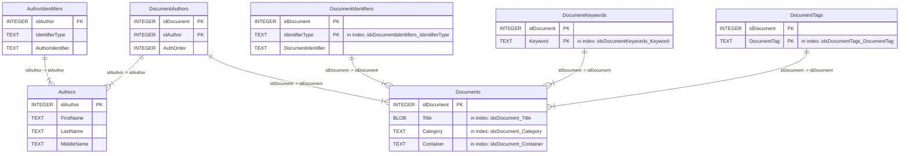

## Project Notes

This file collects practical notes about the internal structure of **Personal Publication DB**. It is intended as a quick reference for understanding the main files in the repository and the current SQLite database model used by the project.

### Repository structure

```text
.
├── db.sql      # SQLite schema used to initialize the database
├── ppubdb.py   # Click-based Python command-line interface
└── README.md   # Project documentation
```

### Database model

The SQLite database is currently structured like:


